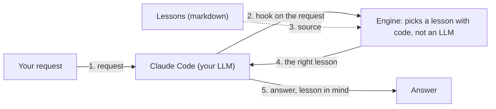

<div align="center">

# claude-memory-engine

A long-term, self-maintaining memory of "lessons" for Claude Code: the right lesson surfaces by itself when it is needed. Plain code, not an LLM, picks the matching lessons, so it works fast, offline, and without third-party dependencies.

   

[Русский](README.md) · **English**

</div>

## What it is

claude-memory-engine gives Claude Code a long-term memory of "lessons". A lesson is a short note about how things are done in the project, what mistakes were already made, and what must not be broken. The assistant writes these lessons itself as it works on the project; you can also add them yourself, but that is optional. The engine keeps the lessons in order and surfaces the right lesson to your LLM exactly when it needs it.

Important: only the mechanism is part of the engine. Your lessons (your knowledge, possibly private data) are stored separately.

## Why you need it

When you work with an AI assistant on a project, a common problem appears: it has no single, persistent memory. Because of that, the same mistakes repeat over and over. To avoid them you keep writing more into the project memory; it grows, the assistant no longer reads a large file in full, and its attention only reaches the first 200 lines. As a result, running a complex project becomes hard and slow.

The engine removes this pain: lessons live as small separate markdown files, the right lesson surfaces by itself at the right moment, the index of all lessons is built automatically, and the memory size stays under control. For details, see "Features" below.

## Quick start

The shortest path:

```
pip install claude-memory-engine
cd /path/to/your/project
claude-memory init
```

The first command installs the engine. `cd` takes you into your project folder. `claude-memory init` connects the engine to this project: it creates the config file, the lessons folder, and makes the engine fire at the right moments. That is all: the hints start working from the next Claude Code session. You do not have to configure anything; the defaults work out of the box. How to change settings is described below in "Configuration".

## How it works

The engine has three layers.

1. **Logic.** A set of small Python programs that do all the work: find the right lesson, build the index, move stale entries to the archive, and so on. It is pure Python with no third-party libraries; nothing extra to install.

2. **Glue to Claude Code.** One small script that Claude Code calls at the right moments (at session start, before a file edit, and so on) and that simply runs the logic.

3. **Data.** The lessons themselves: your knowledge of the project. They are stored separately and are not part of the engine.

Why this split: the first two layers form a universal mechanism that moves to any project, while the third layer holds only your private data. That is why the engine is easy to reuse and even to open-source, while your lessons stay only with you.

Here is what happens on each request: your prompt reaches Claude Code and, through a hook, triggers the engine; the engine picks a lesson from memory with plain code and returns it into the LLM's context; the assistant then answers with the lesson in mind.



The engine also fires on other Claude Code events: before a file edit (path-triggered lesson), at session start and end, and on stop.

## Example output for your LLM assistant

The engine adds a hint with the matching lessons into your LLM assistant's context (you usually do not see it in the chat). It looks roughly like this:

```
[memory:retrieve] Possibly relevant lessons — read the ones you need BEFORE acting (full list: CATALOG):
  • by meaning (keyword):
    - api-error-format: return API errors as {code, message}
    - db-migrations: new DB fields only via a migration, never by hand
  • by file path (applies_to):
    - payment-flow: never change payment status by hand
```

The lessons in the example are made up for illustration. The labels are English by default; localization is covered in "Configuration".

## Features

**Lessons and order**
- Lessons are stored as small markdown files with a short header (name, topic, keywords) plus a single "hot core" (the main file that is always read) with a size limit so it does not grow unbounded.
- The index of all lessons is assembled automatically from their topics; you do not maintain it by hand.

**Hints at the right moment**
- On every request, the engine itself picks matching lessons by their words and shows them to your LLM; if nothing important matches, it stays silent. Plain code does the matching, with no LLM call.
- A lesson can be bound to a file: then it shows up right before the assistant is about to edit that file.
- Hints stay fast even when there are many lessons (thanks to an internal cache).

**The memory maintains itself**
- Old entries move to the archive, a large archive stays easy to navigate, and at the end of a session the engine flags stale rules and broken file bindings.
- The memory size stays under control and does not turn into a junk pile.

**Safety rails**
- If two sessions edit the same memory file, the second one gets a gentle "re-read and retry" instead of silently losing edits.
- At the end of work the engine gently reminds you to record a lesson if none has been written after a fresh commit (especially when the commit closes a task).
- It prevents accidentally launching a helper sub-agent on the most expensive model and keeps a log of such launches.
- It warns if the session model is unknown or the list of known models has not been re-checked for a long time.
- It checks the config file at startup and catches typos before they break anything.

**Flexibility**
- Any language: all of the engine's messages can be translated via settings, without touching the code.
- Works correctly inside a git worktree (a separate working copy of the repository).
- Zero third-party dependencies: only plain Python is required.

## Module map

A table for those who will read or extend the code: which feature is implemented by which module. A regular user does not need it.

**Lessons and order**

| Feature | Module |
|---|---|
| Auto-index and memory health check | `catalog_generate` |

**Hints**

| Feature | Module |
|---|---|
| Lesson matching by request | `memory_retrieve` |
| Fast-matching cache | `sqlite_index` |
| Lessons by file path (including in a git worktree) | `applies_to` |

**The memory maintains itself**

| Feature | Module |
|---|---|
| Archiving old lessons | `memory_archive` |
| Navigating a large archive | `precedent_index` |
| Deleting archived lessons past retention | `archive_prune` |
| Flagging stale items at session end | `staleness` |

**Safety rails**

| Feature | Module |
|---|---|
| Parallel-session protection | `memory_concurrency` |
| Single-line session marker format | `session_marker_guard` |
| Reminder to record a lesson on exit | `stop_check` |
| Guard against the expensive model for sub-agents | `subagent_model_guard` |
| Sub-agent delegation log | `subagent_efficiency_log` |
| Reminder to re-check the model registry | `model_registry_guard` |
| Config self-check | `self_check` |

**Flexibility**

| Feature | Module |
|---|---|
| Translatable messages (i18n) | `messages` |

**Infrastructure**

| Feature | Module |
|---|---|
| All engine settings | `config` |
| Running the logic from a hook | `hooks_cli` |
| Registering hooks in settings.json | `installer` |
| The `claude-memory` command (init/uninstall/doctor/config) | `cli` |

## Installation

There are two ways to install the engine. Both install the same engine and connect the hooks the same way. The only difference is where the engine itself lives: a copy inside each project (variant A) or a single shared install on the whole machine (variant B). The choice does not affect where your lessons are stored.

### Variant A: git + install.sh

Use it when full project self-containment matters: the engine lives inside the project, nothing external.

```
git clone https://github.com/Arnoldig/claude-memory-engine.git
cd claude-memory-engine
./install.sh /path/to/your/project /path/to/your/memory
```

`install.sh` puts the engine inside the project (into `.claude/memory_engine/`), installs the glue script, creates the config file and the memory folder, and registers the hooks in `settings.json` without overwriting anyone else's. Re-running is safe: no duplicates appear. The arguments are optional: then the current folder is taken as the project, and `~/.claude/memory` is used for memory.

### Variant B: pip + one command

Use it when there is one machine and many projects: the engine is installed once and connected to projects with a single command.

```
pip install claude-memory-engine
claude-memory init /path/to/your/project /path/to/your/memory
```

Here the engine stays in the pip environment and is not copied into the project; `claude-memory init` deploys only a thin layer into the project: the glue script, the config file, and the hook registration. The arguments are the same and just as optional.

An important detail: the glue script remembers the exact Python that you installed the package with. If you later change the environment or reinstall the package, run `claude-memory init` again to refresh this binding.

### Which variant to choose

| Question | Variant A (git) | Variant B (pip) |
|---|---|---|
| Where the engine lives | inside the project, a copy in each | once in the pip environment |
| Need a copy of the sources on the machine | yes | no |
| How to update the version | clone again and re-run `install.sh` | `pip install -U` in one place |
| How to connect a new project | clone and run `install.sh` | one command `claude-memory init` |
| Does the project depend on something external | no, self-contained | yes, needs the installed package |

In short, by a single criterion: variant A keeps a separate copy of the engine inside each project (the project depends on nothing external), while variant B keeps one shared engine for the whole machine (convenient to install and update in one place).

A clarification: each project has its own config file (`<project>/.claude/claude-memory.config.json`) regardless of the install variant. So a separate memory per project is configured the same way in both variant A and variant B. In variant B, only the engine code is shared across projects.

Where to store lessons (a shared pool for all projects or a separate one per project) is set by the `memory_dir` option and works the same with either variant: the same memory path for all projects gives a shared pool of lessons, a separate path per project gives separate ones.

In both cases the hooks start working from the next Claude Code session.

## Configuration

All settings live in the project file `.claude/claude-memory.config.json`. Right after installation it is minimal and contains only the project paths:

```json
{
  "memory_dir": "~/.claude/memory",
  "project_root": "."
}
```

(in your file these two lines will hold the real paths filled in at install time)

You do not have to change anything: the defaults work out of the box. To customize, open the file in any text editor from the project root (replace `$EDITOR` with your editor, e.g. `nano` or `code`):

```
$EDITOR .claude/claude-memory.config.json
```

If you installed the engine via pip (variant B), there are two handy commands: `claude-memory config` prints the current settings, and `claude-memory doctor` checks the file for typos.

Below are a few common edits in a "before → after" form. The needed keys are added to the file next to the existing ones; the whole file is not replaced.

**Translate the engine's messages into your language.** A `messages` key is added. In it, each line replaces one built-in English phrase: the phrase name on the left, your text on the right. Only the listed lines are replaced; the rest stay English.

```json
{
  "memory_dir": "~/.claude/memory",
  "project_root": ".",
  "messages": {
    "unit.chars": "символов",
    "retrieve.hook_header": "[память] Возможно полезные уроки. Прочтите нужные ДО действий:"
  }
}
```

What exactly changes in this example:

| Phrase name | Before (default) | After |
|---|---|---|
| `unit.chars` | `chars` | `символов` |
| `retrieve.hook_header` | `[memory:retrieve] Possibly relevant lessons … (full list: CATALOG):` | `[память] Возможно полезные уроки. Прочтите нужные ДО действий:` |

Here `unit.chars` is the word for the size unit when the engine reports memory size (e.g. "12000 символов"). And `retrieve.hook_header` is the header the engine prints before the list of suggested lessons.

**Define your own sections in the lessons index.** A `topic_order` key is added (a short topic name on the left, a section title on the right). By default these are technical topics (`workflow`, `testing`, `infra`, `security`, `docs`, `core`); here we replace them with our own.

```json
{
  "memory_dir": "~/.claude/memory",
  "project_root": ".",
  "topic_order": [
    ["backend", "Backend"],
    ["frontend", "Frontend"],
    ["ops", "Operations & CI"]
  ]
}
```

**Increase the "hot core" limit (the main memory file).** The keys `core_budget_bytes` and `core_size_unit` are added. The default limit is `15000`; here we raise it to `20000`.

```json
{
  "memory_dir": "~/.claude/memory",
  "project_root": ".",
  "core_budget_bytes": 20000,
  "core_size_unit": "chars"
}
```

The full list of all options with their default values is in `examples/claude-memory.config.json` in the repository.

## Requirements

- Python 3.9 or newer.
- Claude Code (the engine works through its hooks).
- No third-party libraries: only the Python standard library is used.

## Tests and development

This section is for those who modify the engine's code: the tests verify that everything still works after changes. A regular user does not need them.

The tests need no network, external database, or Docker: only the Python standard library (200+ tests). Run them like this:

```
pip install pytest
python3 -m pytest
```

The first command installs `pytest` (the test runner), the second runs the whole suite and shows that everything is green.

## Uninstall

The engine does not touch your lessons: the lessons folder (`memory_dir`) stays in place on uninstall.

If you installed via pip (variant B), you can disable the engine in a project with one command:

```
claude-memory uninstall
```

It removes the glue script, the hook registration, and the config file from the project. To also remove the package from the environment: `pip uninstall claude-memory-engine`.

If you installed via git (variant A), remove manually the `.claude/memory_engine/` folder, the `.claude/hooks/cme_hook.sh` file, the `.claude/claude-memory.config.json` file, and the `cme_hook.sh` lines in `.claude/settings.json`.

## Status

The engine is stable and is used in a real production project. Questions, ideas, and bug reports are welcome via the repository's Issues.

## License

Apache-2.0. See the [LICENSE](LICENSE) file.
