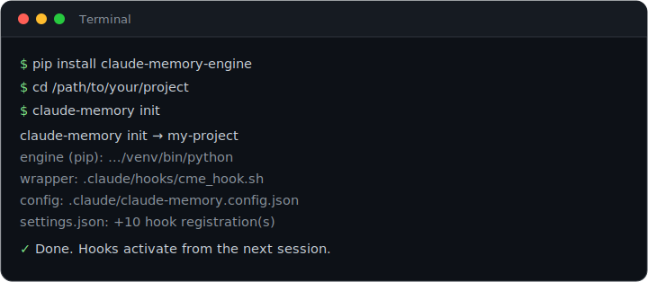
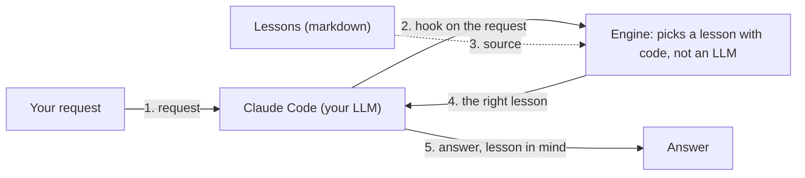

<div align="center">


A long-term, self-maintaining memory of "lessons" for Claude Code: the right lesson surfaces by itself when it is needed. Plain code, not an LLM, picks the matching lessons, so it works fast, offline, and without third-party dependencies.

   

[Русский](README.md) · **English**

</div>

## What it is

claude-memory-engine gives Claude Code a long-term memory of "lessons". A lesson is a short note about how things are done in the project, what mistakes were already made, and what must not be broken. The assistant writes these lessons itself as it works on the project; you can also add them yourself, but that is optional. The engine keeps the lessons in order and surfaces the right lesson to your LLM exactly when it needs it.

Important: only the mechanism is part of the engine. Your lessons (your knowledge, possibly private data) are stored separately.

## Why you need it

When you work with an AI assistant on a project, a common problem appears: it has no single, persistent memory. Because of that, the same mistakes repeat over and over. To avoid them you keep writing more into the project memory; it grows, the assistant no longer reads a large file in full, and its attention only reaches the first 200 lines. As a result, running a complex project becomes hard and slow.

The engine removes this pain: lessons live as small separate markdown files, the right lesson surfaces by itself at the right moment, the index of all lessons is built automatically, and the memory size stays under control. For details, see "Features" below.

## Quick start

The shortest path:

```
pip install claude-memory-engine
cd /path/to/your/project
claude-memory init
```

The first command installs the engine. `cd` takes you into your project folder. `claude-memory init` connects the engine to this project: it creates the config file, locates the folder where Claude Code's built-in auto-memory writes lessons (`~/.claude/projects/<slug>/memory`), and makes the engine fire at the right moments. The engine does not set up a lessons folder of its own — it works with the one Claude Code maintains. That is all: the hints start working from the next Claude Code session. You do not have to configure anything; the defaults work out of the box. How to change settings is described below in "Configuration".

<div align="center">



</div>

## How it works

The engine has three layers.

1. **Logic.** A set of small Python programs that do all the work: find the right lesson, build the index, move stale entries to the archive, and so on. It is pure Python with no third-party libraries; nothing extra to install.

2. **Glue to Claude Code.** One small script that Claude Code calls at the right moments (at session start, before a file edit, and so on) and that simply runs the logic.

3. **Data.** The lessons themselves: your knowledge of the project. They are stored separately and are not part of the engine.

Why this split: the first two layers form a universal mechanism that moves to any project, while the third layer holds only your private data. That is why the engine is easy to reuse and even to open-source, while your lessons stay only with you.

Here is what happens on each request: your prompt reaches Claude Code and, through a hook, triggers the engine; the engine picks a lesson from memory with plain code and returns it into the LLM's context; the assistant then answers with the lesson in mind.



The engine also fires on other Claude Code events: before a file edit (path-triggered lesson), at session start and end, and on stop.

## Example output for your LLM assistant

The engine adds a hint with the matching lessons into your LLM assistant's context (you usually do not see it in the chat). It looks roughly like this:

```
[memory:retrieve] Possibly relevant lessons — read the ones you need BEFORE acting (full list: CATALOG):
  • by meaning (keyword):
    - api-error-format: return API errors as {code, message}
    - db-migrations: new DB fields only via a migration, never by hand
  • by file path (applies_to):
    - payment-flow: never change payment status by hand
```

The lessons in the example are made up for illustration. The labels are English by default; localization is covered in "Configuration".

## Features

**Lessons and order**
- Lessons are stored as small markdown files with a short header (name, topic, keywords) plus a single "hot core" (the main file that is always read) with a size limit so it does not grow unbounded.
- The index of all lessons is assembled automatically from their topics; you do not maintain it by hand.

**Hints at the right moment**
- On every request, the engine itself picks matching lessons by their words and shows them to your LLM; if nothing important matches, it stays silent. Plain code does the matching, with no LLM call.
- A lesson can be bound to a file: then it shows up right before the assistant is about to edit that file.
- Hints stay fast even when there are many lessons (thanks to an internal cache).

**The memory maintains itself**
- Old entries move to the archive, a large archive stays easy to navigate, and at the end of a session the engine flags stale rules and broken file bindings.
- The memory size stays under control and does not turn into a junk pile.

**Safety rails**
- If two sessions edit the same memory file, the second one gets a gentle "re-read and retry" instead of silently losing edits.
- At the end of work the engine gently reminds you to record a lesson if none has been written after a fresh commit (especially when the commit closes a task).
- To re-verify lessons for staleness, write a close phrase at the end of a session (e.g. "Туши свет" or "Done"): the engine replies with a session memory checklist — which lessons surfaced during edits but were not updated, related-by-meaning lessons, and which guards are on. Write this phrase at the end of every session: it is what triggers the check (if you forget, the engine records the debt and reminds you at the next session start). This keeps the memory in sync with the code.
- It prevents accidentally launching a helper sub-agent on the most expensive model and keeps a log of such launches.
- It warns if the session model is unknown, and once a day asks you to re-verify the model lineup (any new/deactivated models) — the result lands in the close checklist.
- It checks the settings at startup and catches typos before they break anything. Separately, it warns if the engine is looking at a different folder than the one Claude Code writes lessons to — otherwise that looks like "all good, just no lessons yet".

**Flexibility**
- Any language: all of the engine's messages can be translated via settings, without touching the code.
- Works correctly inside a git worktree (a separate working copy of the repository).
- Zero third-party dependencies: only plain Python is required.

## Memory guards

The engine ships several "guards" — small automatic checks. They fire at different moments, and what is on or off is always visible in the session summary checklist.

**Stale lessons.** When you write a session-close phrase (`session_close_pattern`), the engine shows a session memory checklist: which lessons surfaced during edits and were not updated (in case your change made them false), related-by-meaning lessons, shelf-life status, and the list of enabled/disabled guards. Triggered by the close phrase. On by default.

**Record lessons.** At the end of a turn, if no lesson has been written after a fresh commit, the engine gently reminds you to capture the outcome. Triggered by a commit, checked at turn end. On.

**Task close.** At the end of a turn, if a commit closes a task (`Closes #N`) but no lesson for it exists, the engine asks you to write one. This is a separate guard from "stale lessons", with its own trigger — a commit, not the phrase. Honestly, this path has a blind spot: it only ever sees the text of the LAST commit, and the `gh issue close` command creates no commit at all — once a project's tracker moves to GitHub Issues, the guard stays quiet on exactly those closures. So there is a second source for the same signal: a Bash hook notices the `gh issue close` command itself and drops a marker in memory, and the same guard reads that marker at Stop and asks for a lesson just as it would for a commit. On by default (`task_close_command_watch`); the marker expires after `task_close_marker_ttl_seconds` seconds (4 hours by default).

**Archive retention.** At session end the engine flags archived lessons older than six months and shows them at the next start as review candidates. The memory never deletes anything itself — that is your call. On (6 months); `0` disables.

**Lesson count.** When the number of lessons exceeds a threshold, a hint to check for exact duplicates appears at startup (not to "merge" — that loses detail). On, threshold `500`; `0` disables.

**Model lineup actuality.** Combines two checks. Reactively: at startup it warns if the session model is not in the confirmed family list (default `opus`, `sonnet`, `haiku`, `fable`). Daily: once a day it asks the assistant to verify the lineup — any new or deactivated models (the check can be delegated to the cheapest model with web search) — and record the result via `cme_hook.sh llm-verified` / `llm-changes`. The result is kept in a state file and shown as a line in the close checklist. On by default (`llm_actuality_enabled`; cadence `llm_actuality_interval_hours`, 24h).

**Parallel sessions.** If another session changed a memory file you are about to edit, the engine asks you to re-read it so edits do not overwrite each other. Always on.

**File size and marker format.** The engine warns when the "hot core" or a lesson exceeds its budget, and refuses to write a malformed session marker. On.

**Expensive sub-agent model.** Once per session it warns if a helper sub-agent is launched on the strongest (expensive) model or without an explicit model choice. On.

**Config self-check.** At every startup it catches settings errors that break things silently: typos in message overrides and in key names, broken regex patterns, non-ISO dates, a task-close pattern (`task_close_pattern`) that has fallen behind the engine's default, and any divergence from Claude Code's own settings — the engine looking at a different folder than the one auto-memory writes to, or auto-memory being off so nobody can write lessons at all. A lagging pattern isn't the same as a broken one: it compiles and runs fine, it just silently fails to recognize some of GitHub's official closing keywords (for example the `resolve/resolves/resolved` family, added in 0.10.0 after the project's copy had already been split off from the default); the check stays quiet on a deliberate full replacement for another issue tracker (a pattern that recognizes none of the words). The last one (Claude Code divergence) matters most: from the outside it looks like "all good, just no lessons yet". On.

## Module map

A table for those who will read or extend the code: which feature is implemented by which module. A regular user does not need it.

**Lessons and order**

| Feature | Module |
|---|---|
| Auto-index and memory health check | `catalog_generate` |

**Hints**

| Feature | Module |
|---|---|
| Lesson matching by request | `memory_retrieve` |
| Fast-matching cache | `sqlite_index` |
| Lessons by file path (including in a git worktree) | `applies_to` |

**The memory maintains itself**

| Feature | Module |
|---|---|
| Archiving old lessons | `memory_archive` |
| Navigating a large archive | `precedent_index` |
| Deleting archived lessons past retention | `archive_prune` |
| Flagging stale items at session end | `staleness` |

**Safety rails**

| Feature | Module |
|---|---|
| Parallel-session protection | `memory_concurrency` |
| Single-line session marker format | `session_marker_guard` |
| Reminder to record a lesson on exit | `stop_check` |
| Second source for the task-close signal (`gh issue close` command) | `issue_close_watch` |
| Stale-lessons checklist on the close phrase | `stale_reconcile` |
| Guard against the expensive model for sub-agents | `subagent_model_guard` |
| Sub-agent delegation log | `subagent_efficiency_log` |
| Model lineup actuality (reactive + daily) | `llm_actuality` |
| Config self-check | `self_check` |

### Verify the lessons path is set up correctly

```bash
python3 -m claude_memory.self_check
```

It prints the picture of your setup and, if something is off, explains what to fix:

```
config self-check report:
  engine memory_dir : /Users/you/.claude/projects/-Users-you-proj/memory
  Claude Code memory: /Users/you/.claude/projects/-Users-you-proj/memory
  same directory    : yes
  lessons visible   : 87  [feedback: 70, project: 10, reference: 6, user: 1]
config self-check: OK
```

**Why this is worth verifying.** Lesson files are not created by the engine — Claude Code's
built-in auto-memory writes them; the engine reads, indexes and guards them. So
`memory_dir` must point exactly where Claude Code writes (`~/.claude/projects/<slug>/memory`).
If the paths diverge, the engine faithfully reads an empty folder: the catalog is empty, no
lessons surface, and the Stop gate demands a lesson that will never appear in its folder. From
the outside this looks like "all good, just no lessons yet" — which is precisely why it is
worth a look.

`same directory: NO`, or `lessons visible: 0` while your memory is not empty, means the path
needs fixing. Since 0.10.0 the installer finds the folder itself, but projects installed
earlier may carry the old `~/.claude/memory` default, which nobody writes to.

**Flexibility**

| Feature | Module |
|---|---|
| Translatable messages (i18n) | `messages` |

**Infrastructure**

| Feature | Module |
|---|---|
| What counts as a lesson, and of which type | `lesson_files` |
| Where Claude Code keeps its auto-memory | `claude_code_env` |
| All engine settings | `config` |
| Running the logic from a hook | `hooks_cli` |
| Registering hooks in settings.json | `installer` |
| The `claude-memory` command (init/uninstall/doctor/config) | `cli` |
| Unknown session model guard | `model_registry_guard` |

## Installation

There are two ways to install the engine. Both install the same engine and connect the hooks the same way. The only difference is where the engine itself lives: a copy inside each project (variant A) or a single shared install on the whole machine (variant B). The choice does not affect where your lessons are stored.

### Variant A: git + install.sh

Use it when full project self-containment matters: the engine lives inside the project, nothing external.

```
git clone https://github.com/Arnoldig/claude-memory-engine.git
cd claude-memory-engine
./install.sh /path/to/your/project /path/to/your/memory
```

`install.sh` puts the engine inside the project (into `.claude/memory_engine/`), installs the glue script, creates the config file, and registers the hooks in `settings.json` without overwriting anyone else's. Re-running is safe: no duplicates appear. The arguments are optional: then the current folder is taken as the project, and the memory folder is auto-detected — the one Claude Code writes auto-memory to (`~/.claude/projects/<slug>/memory`).

### Variant B: pip + one command

Use it when there is one machine and many projects: the engine is installed once and connected to projects with a single command.

```
pip install claude-memory-engine
claude-memory init /path/to/your/project /path/to/your/memory
```

Here the engine stays in the pip environment and is not copied into the project; `claude-memory init` deploys only a thin layer into the project: the glue script, the config file, and the hook registration. The arguments are the same and just as optional.

An important detail: the glue script remembers the exact Python that you installed the package with. If you later change the environment or reinstall the package, run `claude-memory init` again to refresh this binding.

### Which variant to choose

| Question | Variant A (git) | Variant B (pip) |
|---|---|---|
| Where the engine lives | inside the project, a copy in each | once in the pip environment |
| Need a copy of the sources on the machine | yes | no |
| How to update the version | clone again and re-run `install.sh` | `pip install -U` in one place |
| How to connect a new project | clone and run `install.sh` | one command `claude-memory init` |
| Does the project depend on something external | no, self-contained | yes, needs the installed package |

In short, by a single criterion: variant A keeps a separate copy of the engine inside each project (the project depends on nothing external), while variant B keeps one shared engine for the whole machine (convenient to install and update in one place).

A clarification: each project has its own config file (`<project>/.claude/claude-memory.config.json`) regardless of the install variant. So a separate memory per project is configured the same way in both variant A and variant B. In variant B, only the engine code is shared across projects.

Each project's lessons are stored by Claude Code's built-in auto-memory, in a per-project directory (`~/.claude/projects/<slug>/memory`). The `memory_dir` option must point there; with either installation variant the engine locates that directory itself.

The engine itself cannot give you a shared pool of lessons across projects: it creates no lessons — it reads what Claude Code writes, and Claude Code keeps memory per project by default. Simply pointing `memory_dir` at a shared folder makes the engine read a directory nobody writes to: no hints will surface, and the Stop gate will demand a lesson that can never appear there.

Only Claude Code itself can put every project in one folder — via `autoMemoryDirectory` in its `settings.json`. Point `memory_dir` at the same folder and the engine supports that setup natively. To check your path: `python3 -m claude_memory.self_check`.

In both cases the hooks start working from the next Claude Code session.

## Configuration

All settings live in the project file `.claude/claude-memory.config.json`. Right after installation it is minimal and contains only the project paths:

```json
{
  "memory_dir": "/Users/you/.claude/projects/<slug>/memory",
  "project_root": "."
}
```

(in your file these two lines will hold the real paths filled in at install time)

You do not have to change anything: the defaults work out of the box. To customize, open the file in any text editor from the project root (replace `$EDITOR` with your editor, e.g. `nano` or `code`):

```
$EDITOR .claude/claude-memory.config.json
```

If you installed the engine via pip (variant B), there are two handy commands: `claude-memory config` prints the current settings, and `claude-memory doctor` checks the settings for typos, broken patterns, and any divergence from Claude Code's settings.

To see the setup picture itself — where the engine looks, where Claude Code writes, whether the paths match, and how many lessons are visible — run `python3 -m claude_memory.self_check`: it prints the report always, even when everything is fine.

Below are a few common edits in a "before → after" form. The needed keys are added to the file next to the existing ones; the whole file is not replaced.

**Translate the engine's messages into your language.** A `messages` key is added. In it, each line replaces one built-in English phrase: the phrase name on the left, your text on the right. Only the listed lines are replaced; the rest stay English.

```json
{
  "memory_dir": "/Users/you/.claude/projects/<slug>/memory",
  "project_root": ".",
  "messages": {
    "unit.chars": "символов",
    "retrieve.hook_header": "[память] Возможно полезные уроки. Прочтите нужные ДО действий:"
  }
}
```

What exactly changes in this example:

| Phrase name | Before (default) | After |
|---|---|---|
| `unit.chars` | `chars` | `символов` |
| `retrieve.hook_header` | `[memory:retrieve] Possibly relevant lessons … (full list: CATALOG):` | `[память] Возможно полезные уроки. Прочтите нужные ДО действий:` |

Here `unit.chars` is the word for the size unit when the engine reports memory size (e.g. "12000 символов"). And `retrieve.hook_header` is the header the engine prints before the list of suggested lessons.

**Define your own sections in the lessons index.** A `topic_order` key is added (a short topic name on the left, a section title on the right). By default these are technical topics (`workflow`, `testing`, `infra`, `security`, `docs`, `core`); here we replace them with our own.

```json
{
  "memory_dir": "/Users/you/.claude/projects/<slug>/memory",
  "project_root": ".",
  "topic_order": [
    ["backend", "Backend"],
    ["frontend", "Frontend"],
    ["ops", "Operations & CI"]
  ]
}
```

**Increase the "hot core" limit (the main memory file).** The keys `core_budget_bytes` and `core_size_unit` are added. The default limit is `15000`; here we raise it to `20000`.

```json
{
  "memory_dir": "/Users/you/.claude/projects/<slug>/memory",
  "project_root": ".",
  "core_budget_bytes": 20000,
  "core_size_unit": "chars"
}
```

**Set your own session-close phrase.** When your message matches `session_close_pattern`, the engine shows the session memory checklist and re-verifies lessons for staleness. The default is the English phrase `close session`; here we set our own forms and enable case sensitivity (`session_close_case_sensitive`) so a lowercase "done" inside an ordinary sentence does not trigger it.

```json
{
  "memory_dir": "/Users/you/.claude/projects/<slug>/memory",
  "project_root": ".",
  "session_close_pattern": "Туши свет|\\bDone\\b",
  "session_close_case_sensitive": true
}
```

The full list of all options with their default values is in `examples/claude-memory.config.json` in the repository.

## Requirements

- Python 3.9 or newer.
- Claude Code (the engine works through its hooks).
- No third-party libraries: only the Python standard library is used.

## Tests and development

This section is for those who modify the engine's code: the tests verify that everything still works after changes. A regular user does not need them.

The tests need no network, external database, or Docker: only the Python standard library (200+ tests). Run them like this:

```
pip install pytest
python3 -m pytest
```

The first command installs `pytest` (the test runner), the second runs the whole suite and shows that everything is green.

### Releasing a new version

Publishing to PyPI is **automatic** — it runs when a GitHub Release is published, not on a plain `git push`. Steps:

1. Bump the version in `claude_memory/__init__.py` **and** `pyproject.toml` (two places).
2. Add an entry to `CHANGELOG.md` (RU) and `CHANGELOG.en.md` (EN).
3. Commit and push to `main`.
4. Create the release: `gh release create vX.Y.Z --target main` — then `.github/workflows/publish.yml` runs the tests, builds the package and publishes it to PyPI (Trusted Publishing, no tokens).

A GitHub push does **not** update PyPI by itself (step 4 is required). So you don't forget, enable the reminder hook once in your clone:

```
git config core.hooksPath .githooks
```

Then `.githooks/pre-push` checks on push: if the package version has no `vX.Y.Z` tag yet (locally or on origin), it prints a reminder to create the release. The push is not blocked.

## Uninstall

The engine does not touch your lessons: the lessons folder (`memory_dir`) stays in place on uninstall.

If you installed via pip (variant B), you can disable the engine in a project with one command:

```
claude-memory uninstall
```

It removes the glue script, the hook registration, and the config file from the project. To also remove the package from the environment: `pip uninstall claude-memory-engine`.

If you installed via git (variant A), remove manually the `.claude/memory_engine/` folder, the `.claude/hooks/cme_hook.sh` file, the `.claude/claude-memory.config.json` file, and the `cme_hook.sh` lines in `.claude/settings.json`.

## Status

The engine is stable and is used in a real production project. Questions, ideas, and bug reports are welcome via the repository's Issues.

## License

Apache-2.0. See the [LICENSE](LICENSE) file.
