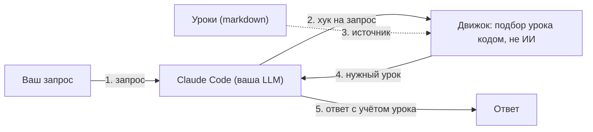

<div align="center">


Долговременная автообновляемая память «уроков» для Claude Code: нужный урок показывается сам, когда он пригодится. Подбор подходящих уроков ведёт обычный код, а не ИИ, поэтому работает быстро, офлайн и без сторонних зависимостей.

   

**Русский** · [English](README.en.md)

</div>

## Что это

claude-memory-engine добавляет в Claude Code долговременную память «уроков». Урок: короткая запись о том, как в проекте принято делать, на какие ошибки уже наступали и что нельзя ломать. Уроки записывает сам ассистент по ходу работы над проектом; при желании вы можете добавлять их и сами, но это не обязательно. Движок упорядочивает уроки и подсказывает вашей LLM нужный урок тогда, когда он ей пригодится.

Важно: в движок входит только механизм. Ваши уроки (это ваши знания и, возможно, приватные данные) хранятся отдельно.

## Зачем это нужно

Когда работаешь с ИИ-ассистентом над проектом, возникает общая проблема: у него нет единой сквозной памяти. Из-за этого одни и те же ошибки повторяются раз за разом. Чтобы их избежать, приходится всё больше записывать в память проекта; она разрастается, а большой файл ассистент уже не читает целиком, и внимание достаётся только первым 200 строкам. В итоге вести сложный проект становится тяжело и долго.

Движок убирает эту боль: уроки лежат маленькими отдельными markdown-файлами, нужный урок показывается сам в подходящий момент, оглавление со всеми уроками собирается автоматически, а размер памяти держится под контролем. Подробнее: смотрите раздел «Возможности» ниже.

## Быстрый старт

Самый короткий путь:

```
pip install claude-memory-engine
cd /путь/к/вашему/проекту
claude-memory init
```

Первая команда ставит движок. Команда `cd` переводит вас в папку вашего проекта. Команда `claude-memory init` подключает движок к этому проекту: создаёт файл настроек, находит папку, куда встроенная авто-память Claude Code пишет уроки (`~/.claude/projects/<slug>/memory`), и делает так, чтобы движок срабатывал в нужные моменты. Своей папки уроков движок не заводит — он работает с той, что ведёт Claude Code. На этом всё: подсказки заработают со следующей сессии Claude Code. Настраивать ничего не нужно, по умолчанию всё работает; как изменить настройки под себя, описано ниже в разделе «Настройка».

<div align="center">


</div>

## Как устроено

Движок состоит из трёх слоёв.

1. **Логика.** Набор небольших программ на Python, которые делают всю работу: находят нужный урок, собирают оглавление, отправляют устаревшее в архив и так далее. Это чистый Python без сторонних библиотек, отдельно ставить ничего не нужно.

2. **Связка с Claude Code.** Один маленький скрипт, который Claude Code вызывает в нужные моменты (в начале сессии, перед правкой файла и тому подобное) и который просто запускает логику.

3. **Данные.** Сами уроки: ваши знания о проекте. Они хранятся отдельно и в движок не входят.

Зачем это деление: первые два слоя составляют универсальный механизм, который переносится в любой проект, а третий слой содержит только ваши приватные данные. Поэтому движок легко переиспользовать и даже открыть публично, а ваши уроки при этом остаются только у вас.

А вот что происходит на каждый ваш запрос: запрос приходит к Claude Code и через хук запускает движок; тот подбирает урок из памяти обычным кодом и возвращает его в контекст LLM; после этого ассистент отвечает с учётом урока.



Движок срабатывает и на другие события Claude Code: перед правкой файла (урок по пути), в начале и в конце сессии, при завершении работы.

## Пример вывода для вашего LLM-ассистента

Подсказку с подходящими уроками движок добавляет в контекст вашего LLM-ассистента (в чате вы её обычно не видите). Выглядит она примерно так:

```
[память] Возможно полезные уроки. Прочтите нужные ДО действий:
  • по смыслу:
    - api-error-format: ошибки отдаём в формате {code, message}
    - db-migrations: новые поля БД только через миграцию, не руками
  • по пути файла:
    - payment-flow: не менять статус оплаты вручную
```

Уроки в примере выдуманы для иллюстрации. По умолчанию надписи английские; перевод — в разделе «Настройка».

## Возможности

**Уроки и порядок**
- Уроки хранятся маленькими markdown-файлами с короткой шапкой (название, тема, ключевые слова) плюс одно «горячее ядро» (главный файл, который читается всегда) с ограничением размера, чтобы оно не разрасталось.
- Оглавление всех уроков собирается само из их тем; вручную его вести не нужно.

**Подсказки в нужный момент**
- На каждый ваш запрос движок сам подбирает подходящие уроки по словам и показывает их вашей LLM; если ничего важного нет, он молчит. Подбор делает обычный код, без обращения к ИИ.
- Урок можно привязать к файлу: тогда он покажется ровно перед тем, как ассистент соберётся править этот файл.
- Подсказки остаются быстрыми, даже когда уроков становится много (за счёт внутреннего кэша).

**Память сама себя поддерживает**
- Старые записи уходят в архив, большой архив остаётся удобным для поиска, а в конце сессии движок помечает устаревшие правила и оборванные привязки уроков к файлам.
- Размер памяти под контролем, в свалку она не превращается.

**Страховки**
- Если две сессии правят один и тот же файл памяти, вторая получает мягкое «перечитай и повтори» вместо тихой потери правок.
- В конце работы движок мягко напоминает записать урок, если после свежего коммита заметки ещё нет (особенно когда коммит закрывает задачу).
- В конце сессии напишите фразу закрытия (например «Туши свет» или «Done») — движок покажет итоги памяти: что стоит перечитать и что устарело. Забыли написать — напомнит на следующем старте.
- Не даёт случайно запустить вспомогательного помощника (суб-агента) на самой дорогой модели и ведёт журнал таких запусков.
- Предупреждает, если модель сессии незнакомая, и раз в сутки просит сверить линейку моделей (нет ли новых/отключённых) — итог попадает в чек-лист закрытия.
- Следит за размером файла инструкций проекта: он читается целиком в каждой сессии, и когда правил становится слишком много, часть из них перестаёт выполняться незаметно.
- Проверяет настройки при старте и ловит опечатки, пока они не сломали работу. Отдельно предупредит, если движок смотрит не в ту папку, куда Claude Code пишет уроки, — иначе это выглядит как «всё хорошо, уроков просто нет».

**Гибкость**
- Любой язык: все надписи движка переводятся через настройки, не трогая код.
- Корректно работает внутри git-worktree (отдельной рабочей копии репозитория).
- Ноль сторонних зависимостей: нужен только обычный Python.

## Стражи памяти

«Стражи» — небольшие автоматические проверки. Они сами напоминают о том, что легко забыть, и срабатывают в разные моменты работы. Что сейчас включено, а что нет, всегда видно в чек-листе итогов сессии.

**Все стражи включены по умолчанию** — иначе их просто не включили бы. Как выключить любого, указано в конце каждого пункта; подробности настройки — в разделе [Настройка](#настройка).

**Итоги памяти.** Вы пишете фразу закрытия сессии — движок показывает сводку: какие уроки стоит перечитать, что близко по смыслу, у чего истекает срок годности. Выключается: `stale_reconcile_gate: false`.

**Запись уроков.** Если после свежего коммита урок в память так и не записан, движок в конце ответа напоминает зафиксировать вывод. Выключается: `stop_lessons_enabled: false`.

**Закрытие задачи.** Если задача закрыта, а урока про неё в памяти нет, движок просит его записать. Замечает оба способа закрытия — и фразу в коммите, и команду в терминале. Выключается: `task_close_lesson_gate: false`.

**Срок хранения архива.** Архивные уроки старше полугода помечаются и на следующем старте показываются как кандидаты на пересмотр. Движок ничего не удаляет сам — решение за вами. Выключается: `archive_stale_months: 0`.

**Счётчик уроков.** Когда уроков накопилось больше порога, на старте появляется подсказка проверить, нет ли среди них дублей. Выключается: `lesson_count_warn: 0`.

**Актуальность линейки моделей.** Предупреждает, если модель сессии незнакомая, и раз в сутки просит сверить, не появилось ли новых моделей. Выключается: `llm_actuality_enabled: false`.

**Параллельные сессии.** Если другая сессия изменила файл памяти, который вы собираетесь править, движок просит перечитать его — чтобы правки не затёрли друг друга. Работает всегда.

**Размер файлов.** Предупреждает, когда файл памяти становится слишком большим, и не даёт записать служебную пометку в неверном формате. Работает всегда.

**Размер файла инструкций.** Файл `CLAUDE.md` — это правила, которые ваш ассистент читает в начале каждой сессии. Он читается целиком, сколько бы в нём ни было написано, и растёт незаметно: по числу строк файл выглядит небольшим, потому что один абзац часто занимает одну очень длинную строку. Беда не в размере как таковом: чем больше правил лежит в контексте разом, тем чаще часть из них просто не выполняется, и снаружи это никак не видно. Когда файл перерастает ориентир, движок говорит об этом один раз — при правке файла, а если его меняли мимо редактора, то на старте следующей сессии. Он ничего не блокирует и не требует сокращать файл до какого-то числа: важные правила должны остаться, даже если файл выходит за ориентир. Выключается: `instructions_budget_chars: 0`.

**Дорогая модель суб-агента.** Один раз за сессию предупреждает, если суб-агент запускается на самой мощной и дорогой модели. Работает всегда.

**Самопроверка настроек.** На каждом старте ищет ошибки, которые ломают работу незаметно: опечатки в настройках, битые шаблоны, неверные даты. Отдельно проверяет главное — читает ли движок ту же папку, куда пишет память Claude Code: при расхождении со стороны кажется, что всё хорошо, просто уроков нет. Работает всегда.

## Карта модулей

Таблица для тех, кто будет читать или дорабатывать код: какая возможность каким модулем реализована. Обычному пользователю она не нужна.

**Уроки и порядок**

| Возможность | Модуль |
|---|---|
| Авто-оглавление и проверка здоровья памяти | `catalog_generate` |

**Подсказки**

| Возможность | Модуль |
|---|---|
| Подбор уроков по запросу | `memory_retrieve` |
| Кэш быстрого подбора | `sqlite_index` |
| Уроки по пути файла (в том числе в git-worktree) | `applies_to` |

**Память сама себя поддерживает**

| Возможность | Модуль |
|---|---|
| Архивирование старых уроков | `memory_archive` |
| Навигация по большому архиву | `precedent_index` |
| Удаление архивных уроков по сроку хранения | `archive_prune` |
| Пометка устаревшего в конце сессии | `staleness` |

**Страховки**

| Возможность | Модуль |
|---|---|
| Защита параллельных сессий | `memory_concurrency` |
| Формат однострочного маркера сессии | `session_marker_guard` |
| Напоминание записать урок на выходе | `stop_check` |
| Второй источник сигнала о закрытии задачи (команда `gh issue close`) | `issue_close_watch` |
| Чек-лист устаревших уроков на фразу закрытия | `stale_reconcile` |
| Контроль дорогой модели у суб-агентов | `subagent_model_guard` |
| Журнал делегирования суб-агентам | `subagent_efficiency_log` |
| Актуальность линейки моделей (реактивно + суточно) | `llm_actuality` |
| Самопроверка настроек | `self_check` |

### Проверить, что путь к урокам настроен верно

```bash
python3 -m claude_memory.self_check
```

Команда печатает картину настройки и, если что-то не так, объясняет, что поправить:

```
config self-check report:
  engine memory_dir : /Users/you/.claude/projects/-Users-you-proj/memory
  Claude Code memory: /Users/you/.claude/projects/-Users-you-proj/memory
  same directory    : yes
  lessons visible   : 87  [feedback: 70, project: 10, reference: 6, user: 1]
config self-check: OK
```

**Почему это важно проверять.** Файлы уроков создаёт не движок, а встроенная авто-память
Claude Code — движок их читает, индексирует и сторожит. Поэтому `memory_dir` обязан
указывать ровно туда, куда пишет Claude Code (`~/.claude/projects/<slug>/memory`). Если пути
разойдутся, движок будет честно читать пустую папку: каталог пуст, подсказок нет, а
Stop-страж требует записать урок, которого в его папке никогда не появится. Со стороны это
выглядит как «всё хорошо, уроков просто пока нет» — потому и стоит проверить глазами.

Строка `same directory: NO` или `lessons visible: 0` при непустой памяти — знак, что путь
надо поправить. Начиная с 0.10.0 установщик находит папку сам, но проекты, поставленные
раньше, могли получить старый дефолт `~/.claude/memory`, куда не пишет никто.

**Гибкость**

| Возможность | Модуль |
|---|---|
| Переводимые надписи (i18n) | `messages` |

**Инфраструктура**

| Возможность | Модуль |
|---|---|
| Что считать уроком и какого он типа | `lesson_files` |
| Где Claude Code держит свою авто-память | `claude_code_env` |
| Все настройки движка | `config` |
| Запуск логики из хука | `hooks_cli` |
| Регистрация хуков в settings.json | `installer` |
| Команда `claude-memory` (init/uninstall/doctor/config) | `cli` |
| Страж незнакомой модели сессии | `model_registry_guard` |

## Установка

Поставить движок можно двумя способами. Оба дают один и тот же результат и одинаково подключают хуки. Разница только в том, где лежит сам движок: своя копия внутри каждого проекта (способ A) или одна общая установка на всю машину (способ B). На то, где хранятся уроки, выбор способа не влияет.

### Способ A: git + install.sh

Подходит, когда важно, чтобы проект был полностью самодостаточным: движок лежит внутри проекта, ничего внешнего.

```
git clone https://github.com/Arnoldig/claude-memory-engine.git
cd claude-memory-engine
./install.sh /путь/к/вашему/проекту /путь/к/папке/памяти
```

Скрипт `install.sh` кладёт движок внутрь проекта (в папку `.claude/memory_engine/`), ставит связующий скрипт, создаёт файл настроек, а также прописывает хуки в `settings.json`, не затирая чужие. Повторный запуск безопасен: дубликаты не появляются. Аргументы можно опустить: тогда проектом считается текущая папка, а каталог памяти определяется автоматически — тот, куда пишет авто-память Claude Code (`~/.claude/projects/<slug>/memory`).

### Способ B: pip + одна команда

Подходит, когда машина одна, а проектов много: движок ставится один раз, а подключается к проектам одной командой.

```
pip install claude-memory-engine
claude-memory init /путь/к/вашему/проекту /путь/к/папке/памяти
```

Здесь движок остаётся в окружении pip и в проект не копируется; команда `claude-memory init` разворачивает в проект только тонкий слой: связующий скрипт, файл настроек и регистрацию хуков. Аргументы те же и так же необязательны.

Важная деталь: связующий скрипт запоминает именно тот Python, которым вы поставили пакет. Если потом сменить окружение или переустановить пакет, выполните `claude-memory init` ещё раз, чтобы обновить эту привязку.

### Какой способ выбрать

| Вопрос | Способ A (git) | Способ B (pip) |
|---|---|---|
| Где лежит движок | внутри проекта, своя копия в каждом | один раз в окружении pip |
| Нужна ли копия исходников на машине | да | нет |
| Как обновить версию | склонировать заново и снова запустить `install.sh` | `pip install -U` в одном месте |
| Как подключить новый проект | склонировать и запустить `install.sh` | одна команда `claude-memory init` |
| Зависит ли проект от внешнего | нет, самодостаточен | да, нужен установленный пакет |

Коротко, по одному признаку: способ A держит отдельную копию движка внутри каждого проекта (проект ни от чего внешнего не зависит), а способ B держит один общий движок на всю машину (ставить и обновлять удобно в одном месте).

Уточнение: файл настроек у каждого проекта свой (`<проект>/.claude/claude-memory.config.json`) при любом способе установки. Поэтому отдельная память на каждый проект настраивается одинаково и в способе A, и в способе B. Общим для всех проектов в способе B остаётся только код движка.

Уроки каждого проекта хранит встроенная авто-память Claude Code — в своём каталоге на проект (`~/.claude/projects/<slug>/memory`). Настройка `memory_dir` должна указывать именно туда; при обоих способах установки движок находит этот каталог сам.

Средствами движка общий пул уроков на все проекты не делается: движок уроков не создаёт — он читает то, что пишет Claude Code, а она по умолчанию ведёт память отдельно по каждому проекту. Если просто направить `memory_dir` в общую папку, движок станет читать каталог, в который никто не пишет: подсказок не будет, а страж завершения начнёт требовать урок, которого там никогда не появится.

Свести все проекты в одну папку может только сам Claude Code — настройкой `autoMemoryDirectory` в его `settings.json`. Тогда туда же нужно направить и `memory_dir`, и движок это поддержит штатно. Проверить свой путь: `python3 -m claude_memory.self_check`.

В обоих случаях хуки начинают работать со следующей сессии Claude Code.

## Настройка

Все настройки лежат в файле проекта `.claude/claude-memory.config.json`. Сразу после установки он минимальный и содержит только пути проекта:

```json
{
  "memory_dir": "/Users/you/.claude/projects/<slug>/memory",
  "project_root": "."
}
```

(у вас в этих двух строках будут реальные пути, подставленные при установке)

Менять что-либо не обязательно: из коробки всё работает на значениях по умолчанию. Чтобы настроить под себя, откройте файл любым текстовым редактором из корня проекта (вместо `$EDITOR` подставьте свой, например `nano` или `code`):

```
$EDITOR .claude/claude-memory.config.json
```

Если вы ставили движок через pip (способ B), есть две удобные команды: `claude-memory config` показывает текущие настройки, а `claude-memory doctor` проверяет настройки на опечатки, битые шаблоны и расхождения с настройками Claude Code.

Чтобы увидеть саму картину настройки — куда смотрит движок, куда пишет Claude Code, совпадают ли пути и сколько уроков видно, — выполните `python3 -m claude_memory.self_check`: он печатает отчёт всегда, даже когда всё в порядке.

Ниже частые правки в формате «было → стало». Нужные ключи добавляются в файл рядом с уже имеющимися; файл целиком не заменяется.

**Перевести надписи движка на свой язык.** Добавлен ключ `messages`. В нём каждая строка заменяет одну встроенную английскую фразу: слева имя фразы, справа ваш текст. Заменяются только указанные строки, остальные остаются английскими.

```json
{
  "memory_dir": "/Users/you/.claude/projects/<slug>/memory",
  "project_root": ".",
  "messages": {
    "unit.chars": "символов",
    "retrieve.hook_header": "[память] Возможно полезные уроки. Прочтите нужные ДО действий:"
  }
}
```

Что именно меняется в этом примере:

| Имя фразы | Было (по умолчанию) | Стало |
|---|---|---|
| `unit.chars` | `chars` | `символов` |
| `retrieve.hook_header` | `[memory:retrieve] Possibly relevant lessons … (full list: CATALOG):` | `[память] Возможно полезные уроки. Прочтите нужные ДО действий:` |

Здесь `unit.chars`: слово для единицы размера, когда движок сообщает объём памяти (например, «12000 символов»). А `retrieve.hook_header`: заголовок, который движок печатает перед списком подсказанных уроков.

**Задать свои разделы в оглавлении уроков.** Добавлен ключ `topic_order` (слева короткое имя темы, справа заголовок раздела). По умолчанию это технические темы (`workflow`, `testing`, `infra`, `security`, `docs`, `core`); здесь заменяем их на свои.

```json
{
  "memory_dir": "/Users/you/.claude/projects/<slug>/memory",
  "project_root": ".",
  "topic_order": [
    ["backend", "Backend"],
    ["frontend", "Frontend"],
    ["ops", "Эксплуатация и CI"]
  ]
}
```

Этот ключ ЗАМЕНЯЕТ заводской список целиком, а не дополняет его: что перечислили — то и будет. Поэтому две подсказки на случай, когда список и уроки разошлись. Если у урока тема написана, но её нет в списке, движок называет само значение — и в оглавлении, и в сводке здоровья («тема задана, но её нет в списке тем конфига»); раньше такой урок попадал в раздел «⚠ без темы» с советом добавить тему, которая на самом деле была. А пустой список (`"topic_order": []`) движок теперь считает ошибкой настройки и говорит об этом на старте: разделов не будет ни одного, и выглядит это точно так же, как «тем ещё никто не проставлял». Чтобы вернуться к заводскому списку, ключ надо убрать, а не обнулять.

**Увеличить лимит «горячего ядра» (главного файла памяти).** Добавлены ключи `core_budget_bytes` и `core_size_unit`. По умолчанию лимит `15000`; здесь увеличиваем до `20000`.

```json
{
  "memory_dir": "/Users/you/.claude/projects/<slug>/memory",
  "project_root": ".",
  "core_budget_bytes": 20000,
  "core_size_unit": "chars"
}
```

**Изменить ориентир размера файла инструкций (`CLAUDE.md`).** Добавлены ключи `instructions_budget_chars` (ориентир в знаках; `0` выключает проверку) и `instructions_files` (за какими файлами следить — пути от корня проекта). По умолчанию ориентир `20000` знаков и следим за одним файлом `CLAUDE.md` в корне. Здесь поднимаем ориентир и добавляем второй файл.

```json
{
  "memory_dir": "/Users/you/.claude/projects/<slug>/memory",
  "project_root": ".",
  "instructions_budget_chars": 30000,
  "instructions_files": ["CLAUDE.md", ".claude/CLAUDE.md"]
}
```

**Задать свою фразу закрытия сессии.** Когда ваше сообщение совпадает с `session_close_pattern`, движок показывает чек-лист итогов памяти и проверяет уроки на устаревание. По умолчанию это английская фраза `close session`; здесь задаём свои формы и включаем учёт регистра (`session_close_case_sensitive`), чтобы строчное «done» в обычной фразе не срабатывало.

```json
{
  "memory_dir": "/Users/you/.claude/projects/<slug>/memory",
  "project_root": ".",
  "session_close_pattern": "Туши свет|\\bDone\\b",
  "session_close_case_sensitive": true
}
```

Полный список всех опций со значениями по умолчанию находится в файле `examples/claude-memory.config.json` в репозитории.

## Требования

- Python 3.9 или новее.
- Claude Code (движок работает через его хуки).
- Сторонние библиотеки не нужны: используется только стандартная библиотека Python.

## Тесты и разработка

Этот раздел для тех, кто дорабатывает код движка: тесты проверяют, что после изменений всё по-прежнему работает правильно. Обычному пользователю они не нужны.

Тесты не требуют сети, внешней базы данных или Docker: только стандартная библиотека Python (их более 200). Запустить так:

```
pip install pytest ruff
python3 -m ruff check .
python3 -m pytest
```

Первая команда устанавливает две программы: `pytest` прогоняет тесты, `ruff` проверяет код. Вторая ищет ошибки, из-за которых часть кода не работает, хотя внешне всё выглядит нормально: опечатка в имени, забытый импорт, недостижимая ветка. Третья запускает весь набор тестов и показывает, что всё «зелёное». То же самое делает GitHub при каждой отправке изменений.

Проверка кода намеренно не придирается к оформлению — ни к длине строк, ни к порядку импортов, ни к кавычкам. Такие замечания быстро учатся заглушать, а вместе с ними глушат и настоящие находки.

### Релиз новой версии

Публикация на PyPI **автоматическая** — она запускается, когда на GitHub публикуется Release, а не при обычном `git push`. Порядок:

1. Поднять версию в `claude_memory/__init__.py` **и** `pyproject.toml` (два места).
2. Добавить запись в `CHANGELOG.md` (рус) и `CHANGELOG.en.md` (англ).
3. Закоммитить и запушить в `main`.
4. Создать релиз: `gh release create vX.Y.Z --target main` — дальше `.github/workflows/publish.yml` сам прогонит тесты, соберёт пакет и опубликует его на PyPI (Trusted Publishing, без токенов).

Пуш в GitHub сам по себе PyPI **не** обновляет (нужен шаг 4). Чтобы не забыть, включите разово хук-напоминалку в своём клоне:

```
git config core.hooksPath .githooks
```

Тогда `.githooks/pre-push` при пуше проверит: если версия пакета ещё не выпущена как тег `vX.Y.Z` (ни локально, ни на origin) — напечатает напоминание создать релиз. Push при этом не блокируется.

## Удаление

Движок не трогает ваши уроки: папка с уроками (`memory_dir`) при удалении остаётся на месте.

Если ставили через pip (способ B), отключить движок в проекте можно одной командой:

```
claude-memory uninstall
```

Она убирает из проекта связующий скрипт, регистрацию хуков и файл настроек. Чтобы убрать и сам пакет из окружения: `pip uninstall claude-memory-engine`.

Если ставили через git (способ A), удалите вручную папку `.claude/memory_engine/`, файл `.claude/hooks/cme_hook.sh`, файл `.claude/claude-memory.config.json` и строки с `cme_hook.sh` в `.claude/settings.json`.

## Статус

Движок стабилен и используется в реальном рабочем проекте. Вопросы, идеи и сообщения об ошибках приветствуются через Issues репозитория.

## Лицензия

Apache-2.0. См. файл [LICENSE](LICENSE).
